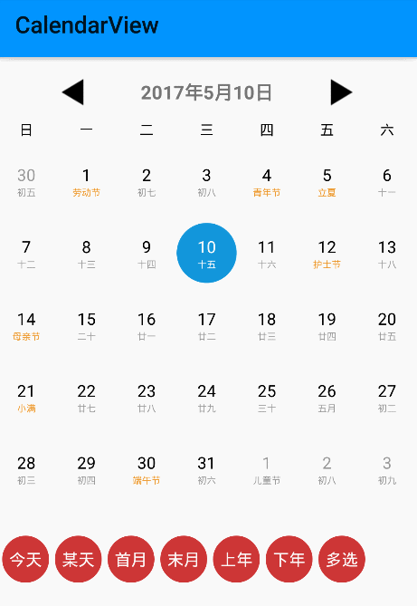
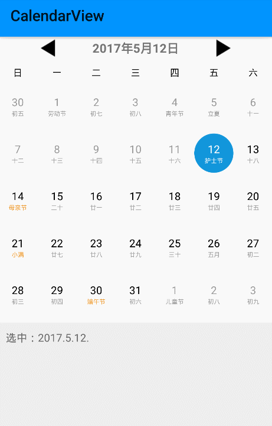
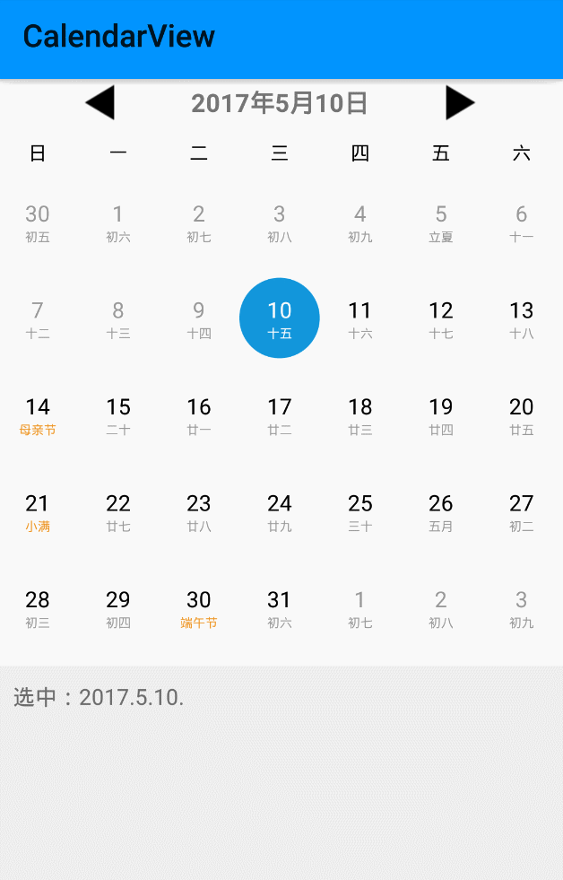

# CalendarView

### 功能
* 1、支持农历、节气、常用节假日
* 2、日期范围设置，默认支持的最大日期范围[1900.1~2049.12]
* 3、禁用日期范围设置
* 4、初始化选中单个或多个日期
* 5、单选、多选操作
* 6、跳转到指定日期
* 7、替换农历为指定文字
* 8、通过自定义属性定制日期外观，以及简单的日期item布局配置
* 9、......

#### [基本原理](http://www.jianshu.com/p/304c8e70d0bd)
#### [demo体验](https://fir.im/vehj?release_id=59fabc7fca87a80715000620)

### 效果图：
||||
|---|---|---|

### 基本用法：
**Step 1. 添加JitPack仓库**
在当前项目等根目录下的 `build.gradle` 文件中添加如下内容:
``` gradle
allprojects {
    repositories {
        ...
        maven { url "https://jitpack.io" }
    }
}
```
**Step 2. 添加项目依赖**
``` gradle
dependencies {
        compile 'com.github.Othershe:CalendarView:1.1.0'
}
```
**Step 3. 在布局文件中添加WeekView、CalendarView**
```java
<com.othershe.calendarview.WeekView
        android:layout_width="match_parent"
        android:layout_height="35dp" />
        
<com.othershe.calendarview.CalendarView
        android:id="@+id/calendar"
        android:layout_width="match_parent"
        android:layout_height="220dp" />
```
**Step 4. 相关初始化**
```java
CalendarView calendarView = (CalendarView) findViewById(R.id.calendar);
//日历init
calendarView
        .setStartEndDate("2010.7", "2018.12")
        .setInitDate("2017.11")
        .setSingleDate("2017.12.12")
        .init();

//月份切换回调
calendarView.setOnPagerChangeListener(new OnPagerChangeListener() {
            @Override
            public void onPagerChanged(int[] date) {
                
            }
        });
        
//单选回调
calendarView.setOnItemClickListener(new OnMonthItemClickListener() {
            @Override
            public void onMonthItemClick(View view, DateBean date) {
                
            }
        });

```
### CalendarView相关方法
|方法名|描述
|---|---|
|setInitDate(String date)|设置日历的初始显示年月
|setStartEndDate(String startDate, String endDate)|设置日历开始、结束年月
|setDisableStartEndDate(String startDate, String endDate)|设置日历的禁用日期范围（小于startDate、大于endDate禁用）
|setSpecifyMap(HashMap<String, String> map)|将显示农历的区域替换成指定文字
|setSingleDate(String date)|设置单选时初始选中的日期（不设置则不默认选中）
|getSingleDate()|得到单选时选中的日期
|setMultiDate(List<String> dates)|设置多选时默认选中的日期集合
|getMultiDate()|得到多选时选中的全部日期
|toSpecifyDate(int year, int month, int day)|单选时跳转到指定年月日
|setOnCalendarViewAdapter(int layoutId, CalendarViewAdapter adapter)|设置自定义日期item样式
|init()|日期初始化（以上属性配置完后调用）
|setOnPagerChangeListener(OnPagerChangeListener listener)|设置月份切换回调
|setOnSingleChooseListener(OnSingleChooseListener listener)|设置单选回调
|setOnMultiChooseListener(OnMultiChooseListener listener)|设置多选回调
|today()| 单选时跳转到今天
|nextMonth()|跳转到下个月
|lastMonth()|跳转到上个月
|nextYear()|跳转到下一年的当前月
|lastYear()|跳转到上一年的当前月
|toStart()|跳转到日历的开始年月
|toEnd()|跳转到日历的结束年月
|CalendarUtil.getCurrentDate()|获得当前日期（今天）

### CalendarView的自定义属性
namespace：xmlns:calendarview="http://schemas.android.com/apk/res-auto"

|属性名|格式|描述|默认值
|---|---|---|---|
|choose_type|enum|设置单选（single）、多选(multi)|single
|show_lunar|boolean|是否显示农历|true
|show_last_next|boolean|是否在MonthView显示上月和下月日期|true
|show_holiday|boolean|是否显示节假日|true
|show_term|boolean|是否显示节气|true
|switch_choose|boolean|单选时切换月份，是否选中上次的日期|true
|solar_color|color|阳历日期的颜色
|solar_size|integer|阳历的日期尺寸|14
|lunar_color|color|农历的日期颜色
|lunar_size|integer|农历的日期尺寸|8
|holiday_color|color|节假日、节气的颜色
|choose_color|color|选中的日期颜色
|day_bg|reference|选中的日期背景(图片)

### WeekView的自定义属性
namespace：xmlns:weekview="http://schemas.android.com/apk/res-auto"

|属性名|格式|描述|默认值
|---|---|---|---|
|week_str|string|周的表示形式，用点隔开（例如：日.一.二.三.四.五.六）
|week_color|color|周的颜色
|week_size|integer|周的尺寸|12
